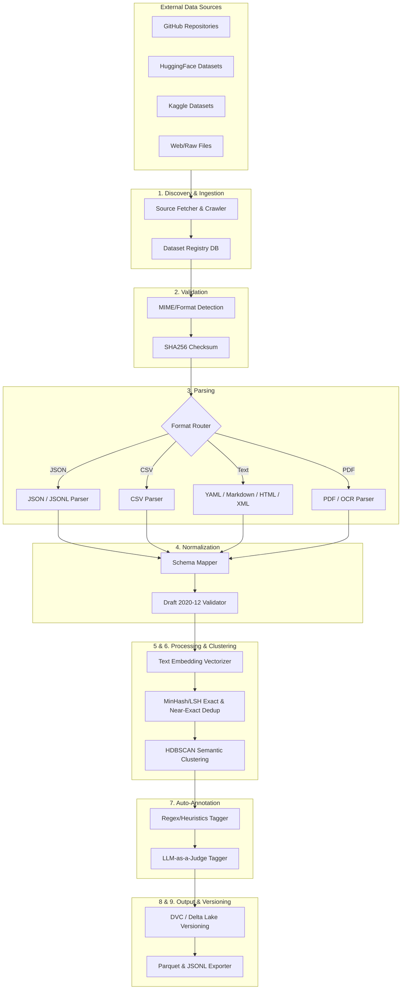

# AegisSwarm Ingestion Pipeline Architecture

## 1. Pipeline Overview

The **AegisSwarm Ingestion Pipeline** (`aegis_ingest`) is a high-throughput, highly scalable Python-based ETL (Extract, Transform, Load) system. It is designed to autonomously fetch, parse, normalize, and enrich heterogeneous AI security datasets into the unified AegisSwarm JSON Schema.

## 2. UML Architecture Diagram



## 3. Python Project Structure

```text
aegis_ingest/
├── pyproject.toml                 # Poetry/Pipenv dependencies
├── main.py                        # CLI entry point (e.g., typer/click CLI)
├── config/
│   ├── __init__.py
│   ├── settings.py                # Pydantic BaseSettings (API keys, DB URIs)
│   └── dataset_registry.yaml      # Configuration of target datasets & fetch schedules
├── discovery/
│   ├── __init__.py
│   ├── fetcher_github.py          # GitHub API integration (clone, sparse-checkout)
│   ├── fetcher_huggingface.py     # `datasets` library integration
│   ├── fetcher_kaggle.py          # Kaggle API integration
│   └── fetcher_raw.py             # Basic HTTP/FTP downloaders
├── validation/
│   ├── __init__.py
│   ├── checksum.py                # SHA256 integrity validation
│   └── type_detector.py           # MIME sniffing and extension verification
├── parsers/
│   ├── __init__.py
│   ├── base_parser.py             # Abstract Base Class for all parsers
│   ├── json_parser.py             # Pandas/Polars JSON/JSONL handling
│   ├── tabular_parser.py          # CSV/Excel parsing
│   ├── markup_parser.py           # BeautifulSoup HTML, Markdown, XML parsing
│   ├── yaml_parser.py             # PyYAML parsing
│   └── pdf_parser.py              # PyPDF2, pdfplumber, and Tesseract OCR integration
├── normalizers/
│   ├── __init__.py
│   ├── schema_mapper.py           # Translates generic dicts into AegisSwarm objects
│   ├── pydantic_models.py         # Pydantic models for the AegisSwarm JSON Schema
│   └── mapping_rules/             # Dataset-specific mapping logic (e.g., JailbreakBench -> Aegis)
├── processing/
│   ├── __init__.py
│   ├── deduplication.py           # Locality-Sensitive Hashing (MinHash) via datasketch
│   ├── clustering.py              # Embedding generation (SentenceTransformers) & HDBSCAN
│   └── annotation.py              # LLM API calls (OpenAI/Anthropic) to backfill missing metadata
├── storage/
│   ├── __init__.py
│   ├── version_control.py         # Data Version Control (DVC) or Delta Lake bindings
│   └── export.py                  # PyArrow integration for writing Parquet/JSONL output
└── utils/
    ├── logger.py                  # Structured JSON logging
    └── concurrency.py             # Asyncio / multiprocessing executors
```

## 4. Reusable Modules & Libraries Recommendation

- **Core Data Processing**: `polars` (for fast, multi-threaded in-memory tabular operations) and `pyarrow` (for Parquet I/O).
- **Validation & Schema**: `pydantic` (for robust typing and schema mapping) and `jsonschema` (for raw JSON validation).
- **Parsing**: `beautifulsoup4` (HTML/XML), `pdfplumber` (PDFs text extraction), `pytesseract` (OCR fallback).
- **Embeddings & NLP**: `sentence-transformers` (for generating embeddings rapidly locally) and `spacy`.
- **Clustering & Dedup**: `datasketch` (for MinHash/LSH exact and near-deduplication of massive text corpora), `scikit-learn`, and `hdbscan` (for semantic attack clustering).
- **Pipeline Orchestration**: `prefect` or `dagster` (to schedule runs, track stage failures, and manage retries) instead of just raw scripts.
- **Versioning**: `dvc` (Data Version Control) integrated via CLI or python API to track changes per pipeline run.
