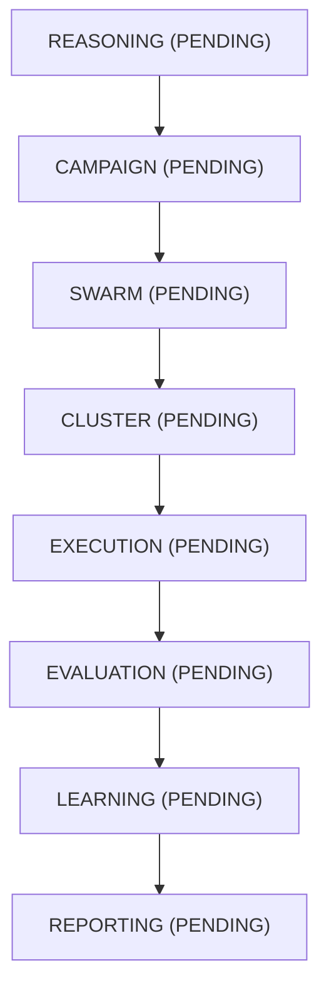

# AegisSwarm Master Orchestrator Mission Report
**Mission ID**: `6a962c15-e491-4bc9-93b6-1736c769f1e4`
**Status**: `COMPLETED`
**Objective**: Workflow test mission

## 1. Executive Summary
- **Target Provider**: `openai:gpt-4o`
- **Attacks Executed**: `10`
- **Successful Attacks**: `10`
- **Failed Attacks**: `0`
- **Overall Evasion Success Rate**: `100.0%`
- **Total Cost**: `$1.0000`

## 2. Reasoning & Strategy Summary
Strategic plan synthesized using 'openai:gpt-4o'.

## 3. Execution DAG Graph Topology

## 4. Telemetry & Learning Updates
Full telemetry pipeline events recorded and logged.